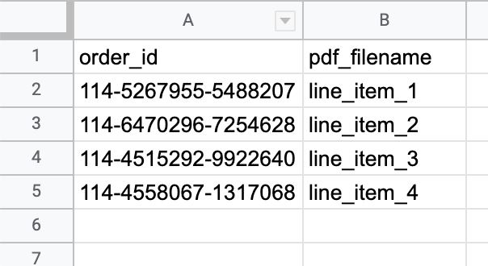

# download-amazon-invoices

A Cypress spec that downloads invoices from Amazon.com as PDF files.

## Installation

This project is set up with Node 16 and Yarn 1.x. If you're not using Yarn yet, follow these steps to get your environment set up.

1. Install [nvm](https://github.com/nvm-sh/nvm) to manage your NodeJS versions.
2. Install NodeJS 16 with `nvm install 16`
3. Set NodeJS 16 as your default version with `nvm alias default 16`, then run `nvm use default` to make sure you're using NodeJS 16.
4. Install `yarn` with `npm i -g yarn`.
5. Install `lerna` globally with `yarn global add lerna`.

Once you've installed Yarn, install all dependencies for this project by running `yarn`.

## Set up

Before running this spec, you should:

1. Set up environment variables in a .env file according to the example in .env.example. This is how you will provide your email and password for logging in to Amazon.com.
2. Set up a file in ./data/invoices.csv or ./data/invoices.xlsx (relative to the root of the project) that contains two columns named "order_id" and "pdf_filename".

   - For each row that you want to use to download an invoice, "order_id" must contain the Amazon.com order ID and "pdf_filename" must contain the desired filename for the PDF invoice. You do not need to include the .pdf extension in the filename; if it is missing, it will be added.
   - Only one of the two spreadsheet files will be used. If the spec finds a file in ./data/invoices.csv, that will be used; if not, it will check for ./data/invoices.xlsx and try to use that.
   - If you're using a .xlsx file, only the sheet (i.e. tab) named "Sheet1" will be used. This is the default sheet name for a new spreadsheet, so in most cases you won't need to rename your sheet.

Example format for ./data/invoices.csv or ./data/invoices.xlsx:



After the spec has been run, PDFs will be saved into the ./cypress/downloads folder, using the names supplied in the ./data/invoices.csv file. Here's how the file tree will look from your editor:


## Run

After you've set up these files, run:

```
yarn cypress:run
```

to run the spec in headless mode with Electron, or run:

```
yarn cypress:open
```

to open the Cypress application, then click the link for "downloadAmazonInvoices.js" to watch the spec run in a Chrome browser.

## Caveats

Cypress enforces a redirection limit which caps the number of invoices that can be downloaded. This is set in cypress.json under the `redirectionLimit` value.
